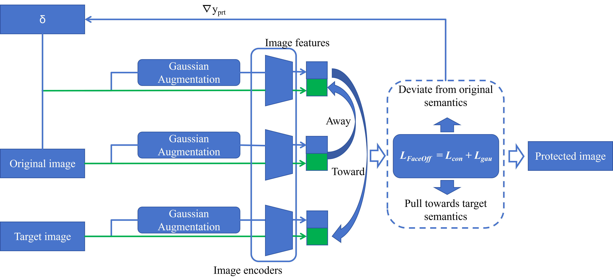
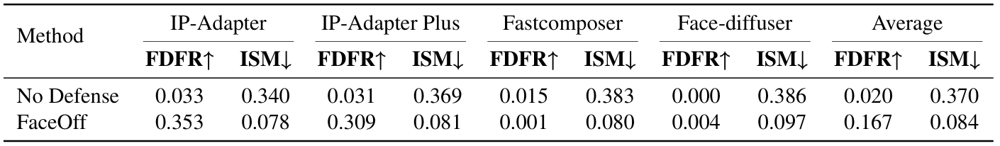
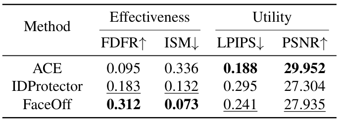
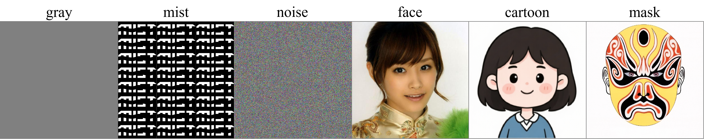
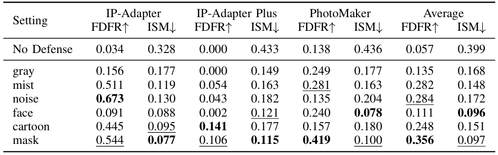
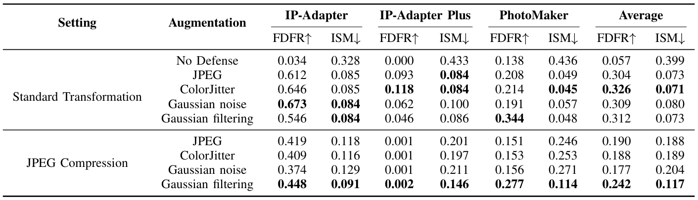

# Supplementary

<figure>
  
  <figcaption>Figure A. Framework of FaceOff.</figcaption>
</figure>

## Framework of FaceOff
Figure A illustrates the overall framework of FaceOff. The framework takes an original image and a target image as inputs, and leverages the image encoders of the target models to extract visual embeddings. The output is a protected image obtained by adding a learnable protective perturbation $\delta$ to the original image. During optimization, we first extract the image embeddings of the original, target, and protected images under two settings: standard customization and Gaussian augmentation. Based on these embeddings, we compute the contrastive loss and the Gaussian augmentation loss, which are jointly used to form the FaceOff objective. The perturbation is then updated by computing gradients with respect to the protected image and applying the PGD algorithm. After iterative optimization, the final protected image is obtained.

<figure>
  
  <figcaption>Table A. Transferability of FaceOff on unseen models. The base model of IP-Adapter and IP-Adapter Plus has been replaced with SD v1.5. Fastcomposer and Face-diffuser are two unseen customization methods with the base model SD v1.5. The evaluation dataset is VGGFace2.
  </figcaption>
</figure>

## Broader models
In Table A, we evaluate FaceOff on unseen base models (SD v1.5) and customization methods (Fastcomposer and Face-diffuser). FaceOff raises the average FDFR from 0.020 to 0.167 and reduces the average ISM from 0.370 to 0.084, indicating its transferability on broader model coverage.

<figure>
  
  <figcaption>Table B. Visual utility for protected images on VGGFace2. bold: best; underline: second best.</figcaption>
</figure>

## Visual utility
In Table B, we evaluate the visual utility of protected images. FaceOff obtains the best protection effectiveness while obtaining suboptimal visual utility. Further research is needed to explore the balance between the perturbation imperceptibility and protection effectiveness.

<figure>
  
  <figcaption>Figure B. Different target images evaluated in our paper.</figcaption>
</figure>

<figure>
  
  <figcaption>Figure C. Impact of different target images. mask is the default target image used in FcaeOff.</figcaption>
</figure>

## Target images
In Figure B, we show the different target images evaluated in our paper, including gray, mist, noise, face, cartoon, and mask. We evaluate the efficacy of FaceOff under different target images in Table C. Note that the face image obtains the lowest ISM, indicating the model tends to generate faces. Among all target images, our default mask image mask obtains the highest FDFR and the second highest ISM. This is because encoder-based models are biased toward facial generation, while cartoon and mask images, despite having similar shapes, deviate from real facial semantics. We do not use the face images as the target images, because we need to spend time retrieving the target face in the semantic space for each face, and we can not guarantee that the faces used are copyrighted.

<figure>
  
  <figcaption>Figure D. Impact of FaceOff with different augmentation strategies on VGGFace2. Gaussian filtering is the default augmentation strategy in FaceOff.</figcaption>
</figure>

## Augmentation strategies
In Table D, we explore the impact of different augmentation strategies. We consider evaluation under Standard Customization and JPEG compression. All augmentation strategies can effectively raise FDFR and reduce ISM values, indicating the flexibility of FaceOff. Among the four augmentation strategies, our defualt Gaussian filtering obtains a balanced performance between Standard Customization and JPEG compression. We believe this is because Gaussian filtering introduces local consistency to adversarial perturbations. The resulting structure makes them more recognizable to the model and less susceptible to being mistaken for noise, while also preserving robustness against JPEG compression removal.

## More qualitative analysis
We supplement more visualization results of the robustness evaluation, ablation study, and target image analysis. 
In Figure C, under standard customization, the customized images of contrastive loss have the least recognized human faces, and the similarity between the recognized face and the original face is the lowest. While under three image transformations, the customized images of the Gaussian augmentation loss have the least recognized human faces, and the similarity between the recognized face and the original face is the lowest. For overall FaceOff, it exhibits balanced performance between standard transformation and three image transformations. 
In Figure D, the customized images of contrastive loss contain fewer human faces and have lower similarity with the original images compared to those with pure deviation loss. After combining with the Gaussian augmentation loss, the recognized human faces rate and face similarity in the customized further reduce. 
In Figure E, we provide the customized images under different target images. The original ID information in the protected customized images has been severely damaged and exhibits features related to the target image. The customized faces corresponding to mask and face exhibit the lowest similarity to the original faces.

<figure>
  
  <figcaption>Figure C. Visualization results of robustness against adversarial purification.</figcaption>
</figure>

<figure>
  
  <figcaption>Figure D. Visualization results of ablation study.</figcaption>
</figure>

<figure>
  
  <figcaption>Figure E. Visualization results of target image analysis.</figcaption>
</figure>
